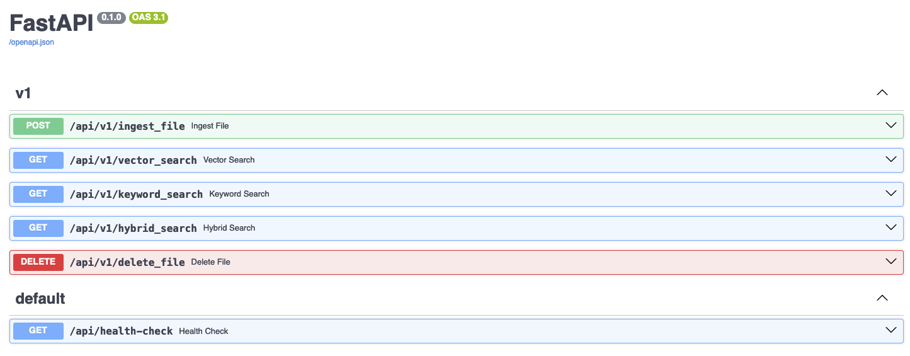

# FastAPI PDF Retrieval Augmented Generation (RAG)

## Run Backend API Locally

```shell
python -m venv venv
source venv/bin/activate
pip3 install -r requirements.txt

source .env
uvicorn server:app --reload \
                  --reload-dir ./app
                  --host localhost
                  --port 8000
# or

sh boot.sh
```

## Build Docker
```shell
image_name=rag-backend-api
docker build -t ${image_name}:latest -f ./Dockerfile . --platform linux/arm64/v8
docker run --env-file docker.env -p 8000:8000 -it --rm --name ${image_name} ${image_name}:latest
```
## API Description and RAG Pipeline




## Run Recommender API Using Docker

```shell
image_name=rag-backend-api
docker build -t ${image_name}:latest . --platform linux/arm64/v8
```

docker.env
```shell
MONGODB_URL=
AWS_ACCESS_KEY_ID=
AWS_SECRET_ACCESS_KEY=
JINA_API_KEY=
```
```shell
image_name=rag-backend-api
docker run --env-file docker.env -p 8000:8000 -it ${image_name}:latest
```


## Build AWS Lambda FastAPI Container
```shell
image_name=lambda-rag-backend-api
docker build -t ${image_name}:latest -f ./Dockerfile.aws.lambda  . --platform linux/arm64/v8
```

## Test the Lambda
```shell
image_name=lambda-rag-backend-api
docker run --env-file docker.env -p 9000:8080 --name lambda-rag-backend-api -it --rm ${image_name}:latest
```


```shell
curl -XPOST "http://localhost:9000/2015-03-31/functions/function/invocations" -d '{
    "resource": "/api/health_check",
    "path": "/api/health_check",
    "httpMethod": "GET",
    "requestContext": {
    },
    "isBase64Encoded": false
}'
```

## Push To ECR

```shell
source .env
account_id=932682266260
region=ap-southeast-1
image_name=lambda-rag-backend-api
repo_name=${image_name}
aws ecr get-login-password --region ${region} | docker login --username AWS --password-stdin ${account_id}.dkr.ecr.${region}.amazonaws.com
```


```shell
aws ecr create-repository \
    --repository-name ${repo_name} \
    --region ${region}
```

```shell
docker tag ${image_name}:latest ${account_id}.dkr.ecr.${region}.amazonaws.com/${repo_name}:latest
```

```shell
docker push ${account_id}.dkr.ecr.ap-southeast-1.amazonaws.com/${repo_name}:latest
```