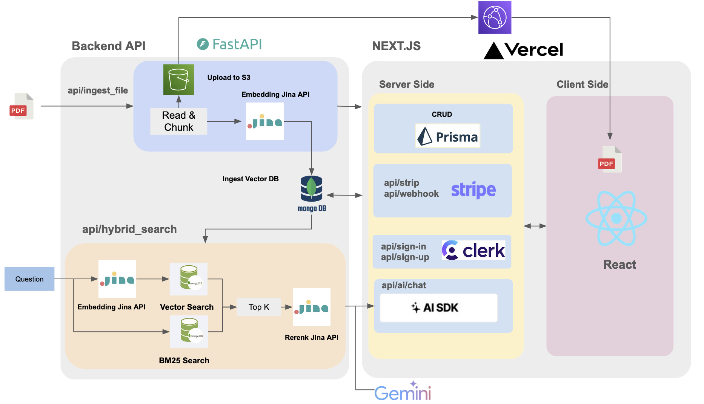
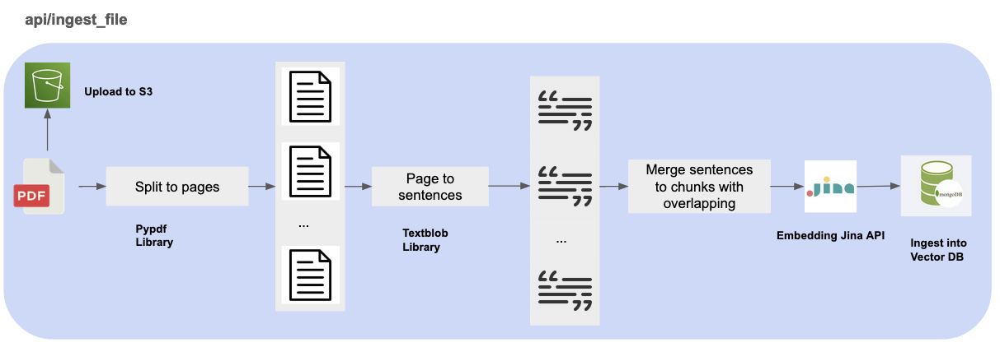

# FastAPI PDF Retrieval Augmented Generation (RAG) APIs

## Introduction
The FastAPI server acts as the main backend API for full stack Chat PDF AI Assistant.

## Highlights:
- The custom "Read & Chunk" component to preprocessing PDF files, splitting pages to sentence and them merge them into chunks for embedding and indexing.
- MongoDB to perform vector similarity and keyword search operations on the database for ingested vector 
- It uses the Jina framework for embedding text data and reranking for retrieval data.
- The "api/hybrid_search" route handles hybrid search queries, combining traditional text search (BM25) with vector similarity search with Jina AI reranking.

## Preview

[`www.chat-pdf-ai.com`](www.chat-pdf-ai.com)


## Overall Architecture

Frontend Github:  https://github.com/Nelsonlin0321/chat-pdf-ai-assistant



## Details about PDF ingestion

- The PDF file is first split into individual pages using a PDF PyPDF.
- Each page is then processed using a textblob library to convert the page content into sentences.
- The sentences from each page are merged into larger chunks with overlapping text between consecutive chunks. This overlapping helps maintain context during search and retrieval.
- The chunked text data is then passed through an embedding pipeline using the Jina Embedding API. This step converts the textual data into high-dimensional vector representations.
- The resulting vector embeddings, along with their corresponding text chunks, are ingested and stored in a vector database like MongoDB.
- The original PDF file also is uploaded to an S3 storage service for front display.




## Run Backend API Locally

```shell
python -m venv venv
source venv/bin/activate
pip3 install -r requirements.txt

source .env
uvicorn server:app --reload \
                  --reload-dir ./app
                  --host localhost
                  --port 8000
# or

sh boot.sh
```

## Build Docker
```shell
image_name=rag-backend-api
docker build -t ${image_name}:latest -f ./Dockerfile .
docker run --env-file docker.env -p 8000:8000 -it --rm --name ${image_name} ${image_name}:latest
```
## APIs Description


## Run Recommender API Using Docker

```shell
image_name=rag-backend-api
docker build -t ${image_name}:latest .
```

docker.env
```shell
MONGODB_URL=
AWS_ACCESS_KEY_ID=
AWS_SECRET_ACCESS_KEY=
JINA_API_KEY=
```
```shell
image_name=rag-backend-api
docker run --env-file docker.env -p 8000:8000 -it ${image_name}:latest
```


## Build AWS Lambda FastAPI Container
```shell
image_name=lambda-rag-backend-api
docker build -t ${image_name}:latest -f ./Dockerfile.aws.lambda  .
```

## Test the Lambda
```shell
image_name=lambda-rag-backend-api
docker run --env-file docker.env -p 9000:8080 --name lambda-rag-backend-api -it --rm ${image_name}:latest
```


```shell
curl -XPOST "http://localhost:9000/2015-03-31/functions/function/invocations" -d '{
    "resource": "/api/health_check",
    "path": "/api/health_check",
    "httpMethod": "GET",
    "requestContext": {
    },
    "isBase64Encoded": false
}'
```

## Push To ECR

```shell
source .env
account_id=932682266260
region=ap-southeast-1
image_name=lambda-rag-backend-api
repo_name=${image_name}
aws ecr get-login-password --region ${region} | docker login --username AWS --password-stdin ${account_id}.dkr.ecr.${region}.amazonaws.com
```


```shell
aws ecr create-repository \
    --repository-name ${repo_name} \
    --region ${region}
```

```shell
docker tag ${image_name}:latest ${account_id}.dkr.ecr.${region}.amazonaws.com/${repo_name}:latest
```

```shell
docker push ${account_id}.dkr.ecr.ap-southeast-1.amazonaws.com/${repo_name}:latest
```

## Deploy To AWS with Infra Codes:

```shell
cd ./infra
terraform init
terraform apply
```
